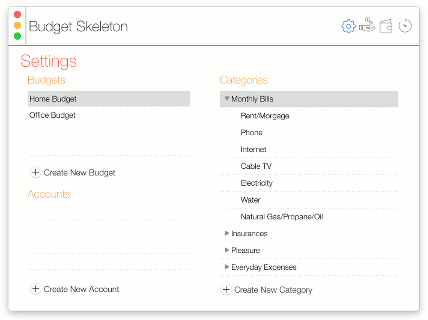
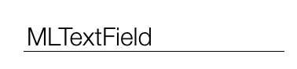
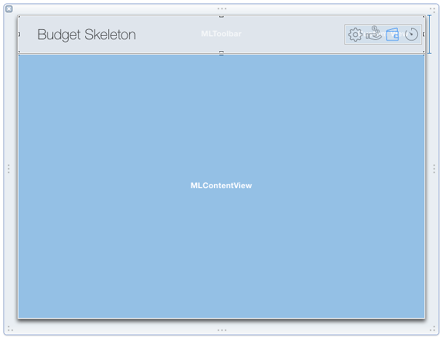

# Modern Look OSX

This project aims to provide a simple and customizable component set which can be used to create OSX applications with new style look.
<p align="center">
	
	<p align="center">
		<em>A skeleton app showing ModernLook-OSX in action</em>
	</p>
</p>

**IMPORTANT NOTICE**

ModernLook-OSX requires OSX 10.10 to work properly. I have tested the components on OSX 10.9 with no success: generally the application runs well on 10.9, but some visual effect does not work. Probably some hacking can help, so if you can make it look better on 10.9 please let me know. However I think this new look does not fit well on older OSX UI.

#Description

ModernLook-OSX is the amalgamation of different ideas found all around the net (especially on [stackoverflow.com](http://stackoverflow.com) ) discussing about how to achieve the look of application rewritten by Apple for Yosemite.

So there is nothing revolutionary, however I hope somebody could find it useful.
 
Most of the components are derived from NS* native components and add special UI code to fit into the general ModernLook. 
For example, there is the MLTextField component which is derived from NSTextField. The new component initializes the NSTextField with hardcoded values (font, colors, etc.) and overrides the original painting code to add a thin line beneath the component.



Here is the code of the MLTextField class.
```objective-c
- (void) commonInit {
	self.font = [NSFont fontWithName:@"Helvetica Neue Light" size:16.0];
	self.bordered = false;
	self.backgroundColor = [NSColor clearColor];
	self.focusRingType = NSFocusRingTypeNone;
}

- (void)drawRect:(NSRect)dirtyRect {
	[NSGraphicsContext saveGraphicsState];
	
	NSRect bounds = [self bounds];
	[[NSColor blackColor] set];
	
	NSBezierPath *bottomLine = [NSBezierPath bezierPath];
	NSPoint p = NSZeroPoint;//bounds.origin;
	p.y = bounds.size.height;
	[bottomLine moveToPoint:p];
	p.x += bounds.size.width;
	[bottomLine lineToPoint:p];
	[bottomLine stroke];
	
	[NSGraphicsContext restoreGraphicsState];
	[super drawRect:dirtyRect];
}
```
You can easily change it to meet your needs, for example draw the line with foreground color, instead of hardcoded black (I plan to add this to the component soon).

#Main components

ModernLook-OSX contains several components to let you create exciting applications, however not all the OSX UI covered yet. I plan to add more component to the package, so stay tuned!

##MLMainWindow
This component can be used to create a window for your application.

##MLWindowContent
This component is used for MLMainWindow's contentView. It draws as a colored, rounded rectangle. You can specify it's color by overriding the backgroundColor property.

##MLToolbar
This component can be used for MLMainWindow's toolbar. This component has nothing common with standard NSToolbar, it simple NSView which just draws the window buttons. The content of the toolbar can be designed in IB.

##MLContentView
You must use this component as your window content base class. 

#Window setup
You can design your window in IB and it is up to you how to layout stuffs. Generally you should add a toolbar and content view to the window, specifying the Custom Class property accordingly.
<p align="center">
	
	<p align="center">
		<em>Window Setup in IB</em>
	</p>
</p>

Above you can see, that the toolbar portion of the window is a custom class of MLToolbar, the content view area is covered by an MLContentView.

You can add any other component to these view, however most of the native NS* components look will be a bit strange. I have added a few components to the ModernLook-OSX and I am working on to more.

#Additional components

##MLTextField
Very similar subclass os NSTextField. It just sets the default font, make the component transparent and draws a thin line beneath the component.

##MLComboField
It is a component similar to NSComboBox, where you can specify the content of the dropdown. It involves the following steps:

1. add an NSTextField to your content in IB and set its custom class to MLComboField
2. create a dropdown content provider object derived from MLComboFieldDelegate and override ```- (MLPopupContent*) createPopupContent;```
3. create a view controller which is derived from MLPopupContent and override ```- (void) moveSelectionUp:(BOOL)up;``` and ```- (NSString*) moveSelectionTo:(NSString*)str;```
4. add your dropdown content provider to IB and set it as delegate of the MLComboField.

##MLOutlineView
This component is derived from NSOutlineView and it replaces the outline view header control to dd custom drawing to it.

##MLTableView
This component is derived from NSTableView and it replaces the outline view header control to dd custom drawing to it.

##MLRadioGroupManager
It is really not a component, just a manager to mimic Segmented Control and needs further improvements. Anyways, it works as follows: add an object with custom class as MLRadioGroupManager and an NSView to IB and place some NSButton into it. Configure the buttons style to square and type to switch. Assign the buttons' sent action to the MLRadioGroupManager. Also assign the buttons parent view to the MLRadioGroupManager as groupView. With this setup the MLRadioGroupManager will act like a radio button group, so only one button can be selected at a time. Yes, I know it is a bit confusing, but you should take a look at the sample application's toolbar.

#Sample Application
The provided sample application is an imagined Budget app. It has 4 separate area:

1. Settings panel
2. Accounts panel
3. Budget panel
4. Prediction panel

The application has a toolbar, where the user can switch between the application panels.

#Known issues

1. the window buttons on the toolbar behave strange. There is no images in them and they don't highlighted when the window is not selected, they just remain grayed out when the mouse hovered over.
2. MLComboField dropdown remains on screen sometimes (switch to another windows, for example)
3. MLTextField text selection covers the bottom thin line.

#License
MIT


 
